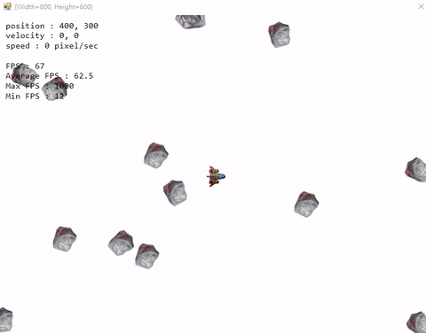

# C-Sharp-Asteroids-Game

### 問題
1. type_C的爆炸動畫串列檔案太大，需要再載入時先分割，再一一撥放，有待改良 
暫時用別張爆炸特效圖來代替
2. 關於Animation從Class換Struct就可正常使用的原因還有待確認

## ship-test5: 
加入爆炸特效 
修正Entity的Animation會同步撥放的問題，因為是以物件參考，所以全部都連到同個Animation 
解決方法:以將Class換成Struct 

## ship-test4: 
加入行星 
當行星被子彈擊中時消失 

## ship-test3: 
Animation函式庫 
Entity Class 
Bullet Class 
Ship Class 

## ship-test3.1: 
使用DeltaTime穩定移動速度

## ship-test2: 
雙緩衝 
FPS穩定 

## ship-test1: 
基本移動與更新 

